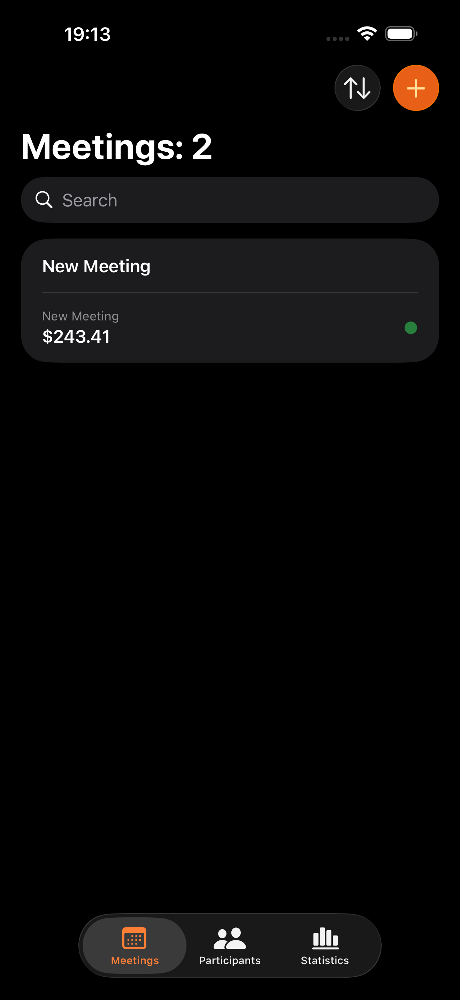
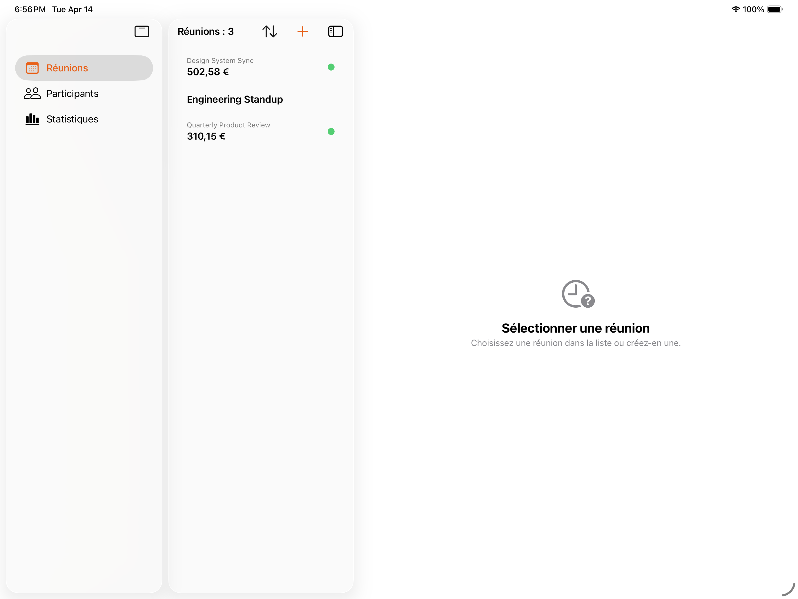
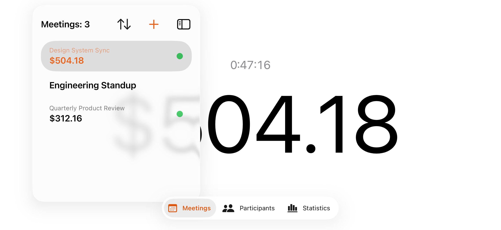
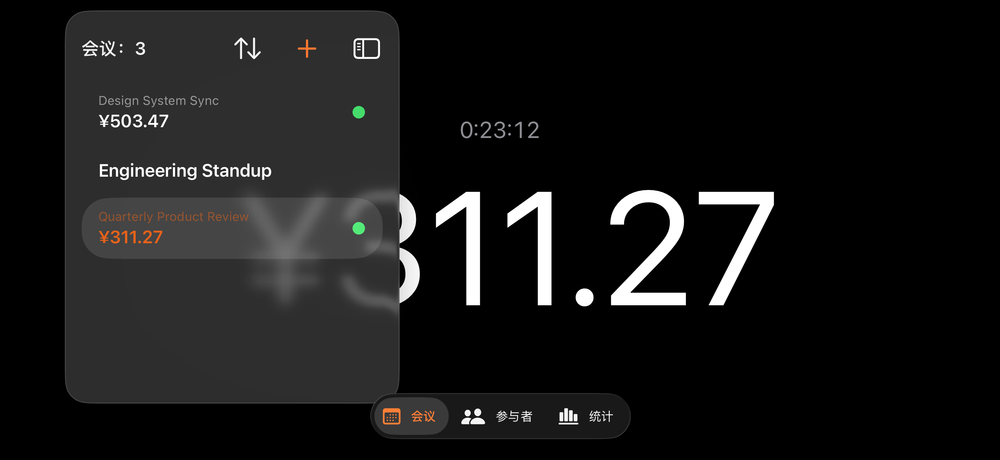
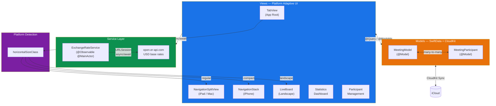
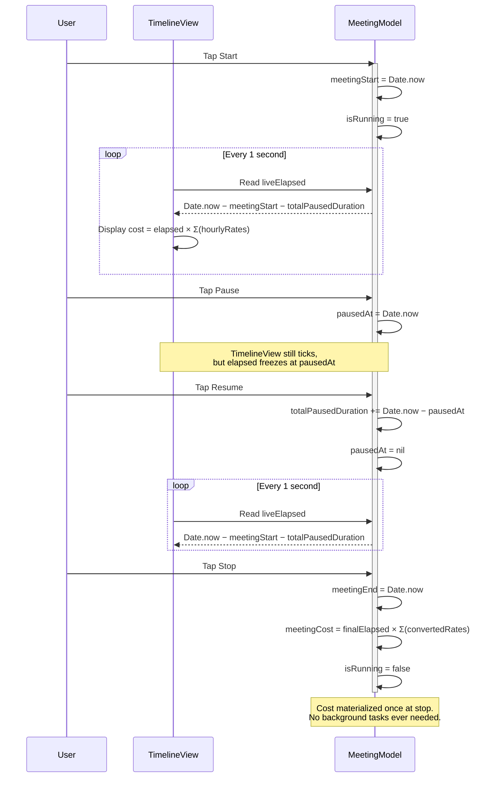
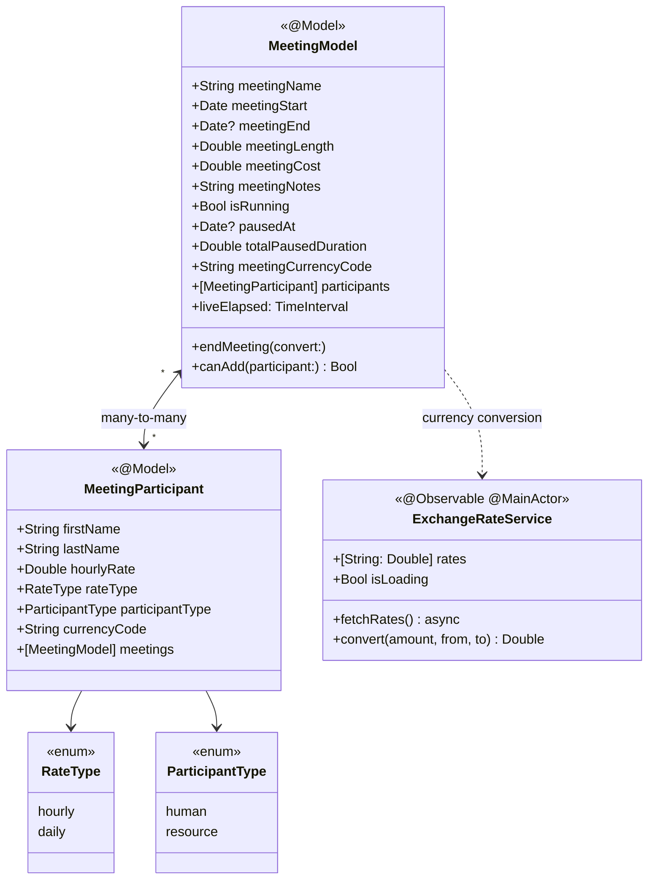
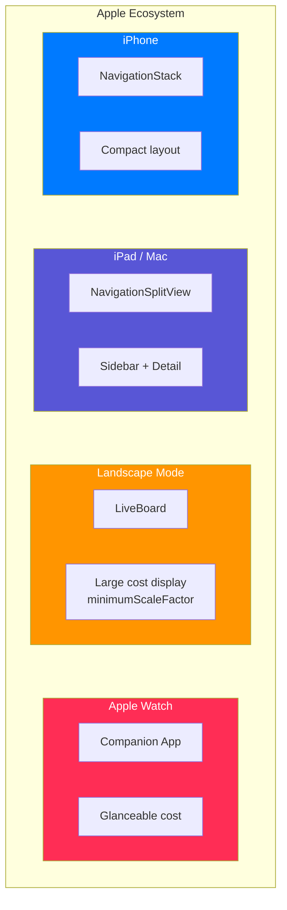

<div align="center">

# MeetCost — Meeting Cost Calculator

**Know exactly what every meeting costs. In real time.**

A cross-platform Apple-native meeting cost tracker built with SwiftUI, SwiftData, and Swift Charts.
iPhone, iPad, Mac, and Apple Watch — 1,747 lines of Swift, zero external dependencies.

[](https://swift.org)
[](https://developer.apple.com/ios/)
[](https://developer.apple.com/swiftui/)
[](https://developer.apple.com/xcode/swiftdata/)
[](https://developer.apple.com/documentation/charts)
[](LICENSE)
[](#tech-stack)

</div>

---

## Screenshots

<table>
  <tr>
    <td align="center" width="25%">
      <br>
      <sub><b>Meeting List</b></sub>
    </td>
    <td align="center" width="25%">
      <br>
      <sub><b>Live Cost Ticker</b></sub>
    </td>
    <td align="center" width="25%">
      <br>
      <sub><b>Running Alternate</b></sub>
    </td>
    <td align="center" width="25%">
      <br>
      <sub><b>iPad</b></sub>
    </td>
  </tr>
</table>

---

## Features

| | Feature | Description |
|---|---|---|
| **Cost Tracking** | Live cost ticker | Per-second cost updates via `TimelineView` — no timers, no background tasks |
| **Concurrency** | Multiple meetings | Run several meetings simultaneously with independent pause/resume |
| **Currency** | Multi-currency | Each participant carries their own currency; converted live via exchange rates |
| **Resources** | Conflict detection | Rooms, projectors, and equipment can only attend one running meeting at a time |
| **Analytics** | 5-chart dashboard | Interactive Swift Charts with full `AXChartDescriptorRepresentable` accessibility |
| **Sync** | CloudKit | SwiftData with CloudKit backend — seamless cross-device sync |
| **Adaptive UI** | Platform-native | `NavigationSplitView` on iPad/Mac, `NavigationStack` on iPhone, landscape cost board |
| **Localization** | 11 languages | English, French, Spanish, German, Japanese, Russian, Arabic, Hindi, Portuguese (BR), Chinese (Simplified), Bengali |
| **Accessibility** | Full VoiceOver | Labels, hints, chart descriptors, reduce-motion support, Dynamic Type |
| **Privacy** | Zero data collection | No tracking, no analytics, no sensitive permissions |

---

## Architecture

MeetCost follows **MVVM with SwiftData**, using Apple's `@Observable` and `@Model` macros for clean reactive data flow. The entire app runs on pure Swift concurrency — no GCD, no Combine, no Dispatch.



---

## Timer Architecture

The timer is MeetCost's key differentiator. Instead of `Timer`, `DispatchSourceTimer`, or background tasks, it uses **pure timestamp arithmetic** that survives app backgrounding without `BGTaskScheduler`.



**Why this matters:**
- App can be killed and relaunched — elapsed time is always correct from timestamps
- No battery drain from background timers or `BGTaskScheduler`
- `TimelineView(.periodic(from:by:1))` handles the 1 Hz UI refresh declaratively
- `accessibilityReduceMotion` gracefully switches from animated to static transitions

---

## Class Diagram



---

## Platform Support



| Platform | Navigation | Key Adaptation |
|---|---|---|
| **iPhone** | `NavigationStack` | Compact single-column layout |
| **iPad** | `NavigationSplitView` | Sidebar with meeting list, detail pane |
| **Mac** (Catalyst) | `NavigationSplitView` | Desktop-native sidebar experience |
| **Landscape** | LiveBoard | Large-format cost display with `minimumScaleFactor` |
| **Apple Watch** | Companion | Glanceable meeting cost on the wrist |

Platform detection uses `horizontalSizeClass` at runtime — one codebase, adaptive everywhere.

---

## Tech Stack

| Layer | Framework | Role |
|---|---|---|
| UI | **SwiftUI** | Declarative cross-platform interface |
| Data | **SwiftData** | Persistence with `@Model` macros |
| Sync | **CloudKit** | Transparent cross-device sync via SwiftData |
| Charts | **Swift Charts** | 5 chart types with accessibility descriptors |
| Observation | **Observation** | `@Observable` macro for reactive state |
| Networking | **URLSession** | `async/await` exchange rate fetch |
| Concurrency | **Swift Concurrency** | Swift 6.2 "Approachable Concurrency" — zero GCD |
| Testing | **Swift Testing** + **XCTest** | Unit + UI test suites |
| Localization | **.xcstrings** | 11 languages with plural rules |

**External dependencies: 0.** Every framework ships with Xcode.

---

## Highlights

### Timestamp-Based Timer
No `Timer`, no `DispatchSourceTimer`, no `BGTaskScheduler`. Elapsed time is pure date arithmetic (`Date.now - meetingStart - totalPausedDuration`), making the timer immune to app suspension. `TimelineView` provides declarative 1 Hz UI refresh.

### Resource Scheduling Constraint
Resources (rooms, projectors) are validated with a `#Predicate` query that checks for active meetings — a resource cannot join a second running meeting. This prevents double-booking at the data layer.

### Multi-Currency Lazy Conversion
Each participant stores their own `currencyCode` and `hourlyRate`. Conversion to the meeting's base currency happens at display time using live exchange rates from [open.er-api.com](https://open.er-api.com), with graceful degradation if the network is unavailable.

### Full Accessibility
Every interactive element carries `accessibilityLabel` and `accessibilityHint`. All five charts implement `AXChartDescriptorRepresentable` for VoiceOver. `accessibilityReduceMotion` disables animations and switches `numericText` transitions to `.identity`. Dynamic Type is supported via SwiftUI font styles.

### Cross-Platform Adaptive UI
A single `horizontalSizeClass` check at the navigation root switches between `NavigationSplitView` (iPad/Mac) and `NavigationStack` (iPhone). Landscape orientation triggers a dedicated LiveBoard with large-format cost display.

### CloudKit Sync
SwiftData's CloudKit integration provides transparent cross-device sync. Meetings, participants, and their many-to-many relationships replicate automatically.

### Zero Dependencies
The entire app is built with Apple-provided frameworks. No SPM packages, no CocoaPods, no Carthage — reducing build complexity, audit surface, and long-term maintenance.

---

## Testing

| Suite | Framework | Tests | Coverage |
|---|---|---|---|
| **Unit** | Swift Testing | 8 tests | Rate normalization, cost calculation, timer logic, resource conflict validation |
| **UI** | XCTest / XCUITest | 5 tests | Add/delete meeting, timer start/pause/stop, add participant |

Unit tests use an **in-memory SwiftData store** for isolation and speed.

```
swift test
```

---

## Requirements

| | Minimum |
|---|---|
| **iOS / iPadOS** | 18.0+ |
| **macOS** | 15.0+ |
| **watchOS** | 11.0+ |
| **Xcode** | 16.0+ |
| **Swift** | 6.2 |

---

## Getting Started

```bash
git clone https://github.com/arthurkahwa/meetingclock.git
cd meetingclock
open MeetCost.xcodeproj
```

Build and run on any simulator or device. No dependencies to install. No configuration needed.

---

## License

This project is licensed under the **MIT License** — see the [LICENSE](LICENSE) file for details.

---

<div align="center">

**Built with Swift and SwiftUI by [Arthur Kahwa](https://github.com/arthurkahwa)**

*Crafted with zero external dependencies. Every framework ships with Xcode.*

</div>
